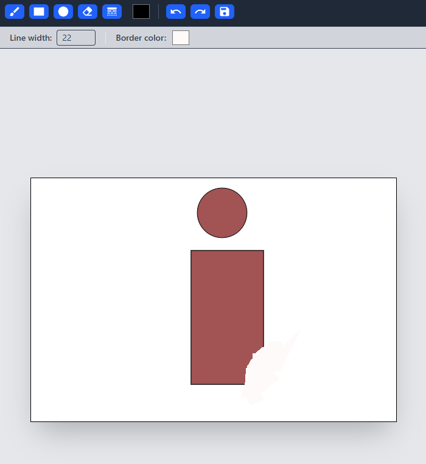

# Collaborative Paint (Real-time Canvas)

A high-performance, real-time collaborative drawing application that allows multiple users to draw on the same canvas simultaneously. Built with a modern tech stack focused on type safety, state management, and low-latency communication.

## 🚀 Features

- Real-time Synchronization: Draw with friends in real-time using WebSockets.
- Drawing Toolkit: Includes Brush, Rectangle, Circle, Line, and Eraser.
- Persistent Canvas: Automatic saving of canvas state to the server (Node.js/Express).
- Undo/Redo System: Global history management for easy corrections.
- Collaborative Sessions: Unique room IDs via URL routing.
- Modern UI: Clean, responsive interface built with Tailwind CSS.

## 🛠 Tech Stack
    
### Frontend

- React 18 + TypeScript
- Zustand: Lightweight state management for tools and canvas state.
- Tailwind CSS: Utility-first styling.
- React Router v6: Dynamic routing for collaborative rooms.
- HTML5 Canvas API: Core rendering engine.

### Backend

- Node.js & Express: REST API for image persistence.
- Express-ws: WebSocket implementation for real-time broadcasts.
- Docker: Containerized environment for consistent deployment.

## 📦 Installation & Setup

1. Clone the repository

```
git clone https://github.com/yourusername/collaborative-paint.git
cd collaborative-paint
```

2. Run with Docker (Recommended)

```
docker-compose up --build
```
